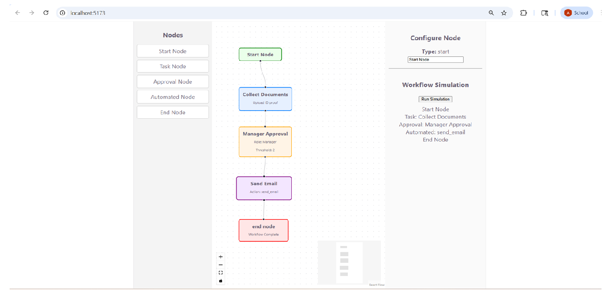
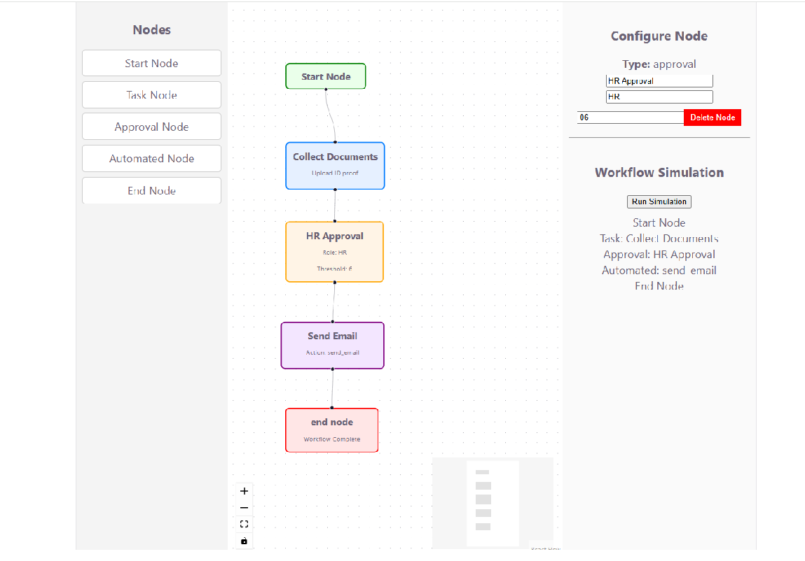
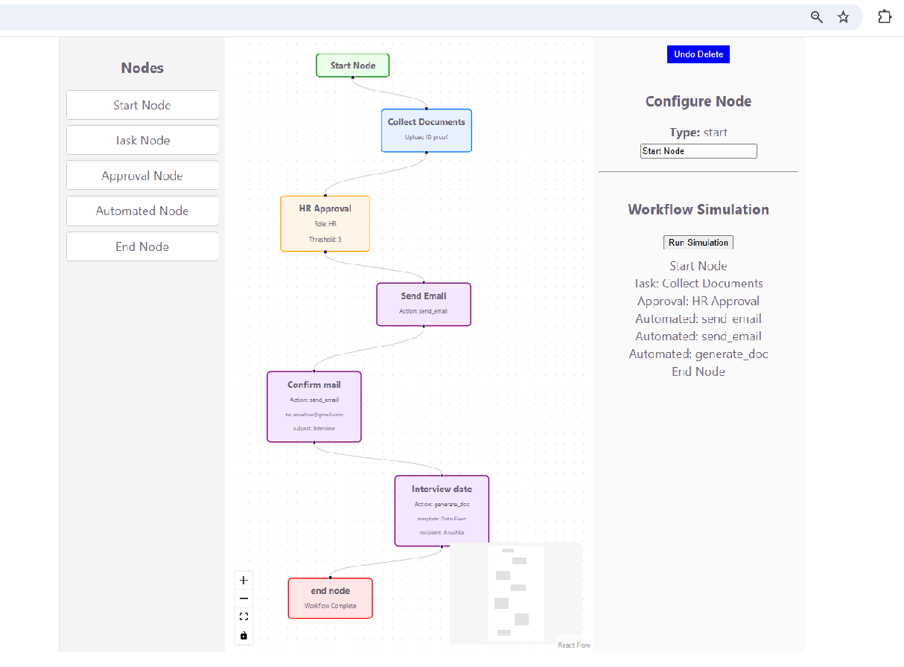
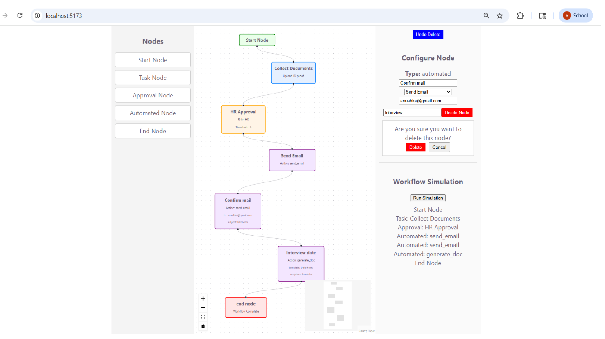
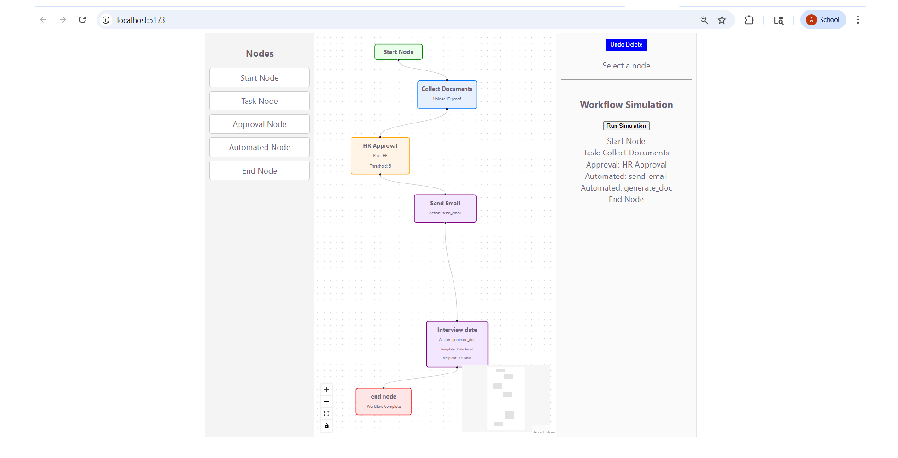
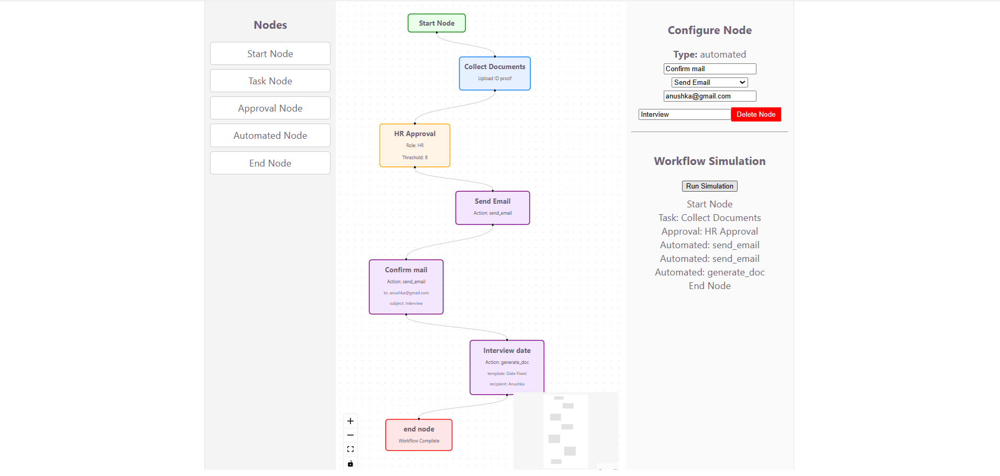

# HR Workflow Designer (React + React Flow)

## Live Application

The project has been successfully deployed and is accessible online:
hr-workflow-designer-mpic.vercel.app

## Overview

This project is a **mini HR Workflow Designer** that allows users to visually design, configure, and simulate workflows such as onboarding, approvals, and automated processes.

It demonstrates **graph-based UI design, dynamic forms, and workflow execution logic**, similar to real-world workflow engines.

---

##  Architecture

The application is designed with a **modular and scalable structure**:

```
src/
│
├── api/
│   └── mockApi.ts              // Mock APIs (automations + simulation)
│
├── components/
│   ├── Layout.tsx             // App layout structure
│   ├── Sidebar.tsx            // Node palette (drag & drop)
│   ├── WorkflowCanvas.tsx     // React Flow canvas
│
├── hooks/
│   └── useAutomations.ts      // Fetch automation actions
│
├── nodes/
│   ├── StartNode.tsx
│   ├── TaskNode.tsx
│   ├── ApprovalNode.tsx
│   ├── AutomatedNode.tsx
│   ├── EndNode.tsx
│
├── panels/
│   ├── NodeConfigPanel.tsx    // Dynamic node configuration
│   ├── SimulationPanel.tsx    // Workflow execution UI
│
├── store/
│   └── workflowStore.ts       // State abstraction (extensible)
│
├── types/
│   └── workflow.types.ts      // Type definitions
│
├── App.tsx                   // Root state + orchestration
├── main.tsx                  // Entry point
├── index.css                 // Global styles
```

---

## Screenshots

### Workflow Canvas


### Node Configuration


### Automation Selection


### Delete Popup


### Undo Feature


### After Undo Fix


## How to Run

### 1. Install dependencies

```bash
npm install
```

### 2. Start development server

```bash
npm run dev
```

### 3. Open in browser

```
http://localhost:5173
```

---

##  Features Implemented

### 1. Workflow Canvas (React Flow)

* Drag-and-drop nodes from sidebar
* Connect nodes using edges
* Node positioning and interactions

### Node Types

* Start Node
* Task Node
* Approval Node
* Automated Node
* End Node

---

### 2. Node Configuration Panel

Dynamic forms based on node type:

* **Start Node** → Title
* **Task Node** → Title, Description, Assignee
* **Approval Node** → Title, Role, Threshold
* **Automated Node** → Action + Dynamic Parameters (from API)
* **End Node** → Completion node

---

### 3. Graph Constraints

* Only **one Start node allowed**
* Only **one End node allowed**
* Single incoming and outgoing connection per node
* Prevent self-connections

---

### 4. Delete Node (Advanced Feature)

* Delete via right panel
* Custom confirmation popup
* Automatically removes connected edges
* Start node deletion is disabled

---

### 5. Undo Feature

* Restore last deleted node
* Restore associated edges safely
* Handles edge conflicts intelligently

---

### 6. Mock API Layer

* `GET /automations` → returns available automation actions
* `POST /simulate` → executes workflow logic

---

### 7. Workflow Simulation Engine

* Starts execution from Start node
* Traverses graph using edges
* Ensures correct execution order
* Stops at End node
* Displays execution steps

---

##  Design Decisions

### 1. Graph-Based Execution

Instead of iterating nodes directly, simulation:

* Starts from Start node
* Follows edges step-by-step
* Ensures correct workflow order

---

### 2. Undo Handling

* Stores last deleted node and edges
* Prevents duplicate restoration
* Resolves edge conflicts during undo

---

### 3. Dynamic Form Architecture

* Forms driven by node type
* Easily extensible for new node types

---

### 4. Separation of Concerns

* UI (components)
* Logic (hooks/store)
* API layer (mockApi)
* Types (TypeScript interfaces)

---

##  Completed vs Future Improvements

### Completed

* Workflow canvas with React Flow
* Custom node types
* Dynamic configuration panel
* Graph constraints & validation
* Delete + Undo functionality
* Mock API integration
* Graph-based simulation engine

---

###  Future Improvements

* Multi-level Undo/Redo (history stack)
* Cycle detection in workflow
* Visual validation errors on nodes
* Export / Import workflow JSON
* Auto-layout for better node positioning
* Step-by-step execution animation
* Backend persistence (database integration)

---

## Tech Stack

* React (Vite)
* TypeScript
* React Flow
* CSS

---

## Key Highlight

A major challenge solved was ensuring **correct workflow execution after node deletion and undo**, which required:

* Conflict-safe edge restoration
* Graph-based traversal logic
* Filtering invalid nodes and edges

---

## Conclusion

This project demonstrates:

* Strong React architecture skills
* Graph-based problem solving
* Dynamic UI + form handling
* Real-world workflow execution logic

---

## Author

Submitted as part of Tredence Internship (Frontend Assignment)
